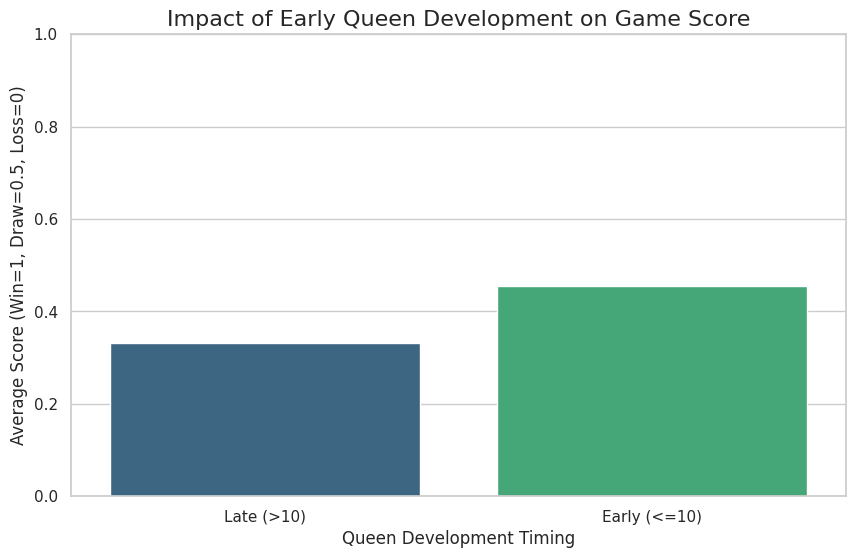
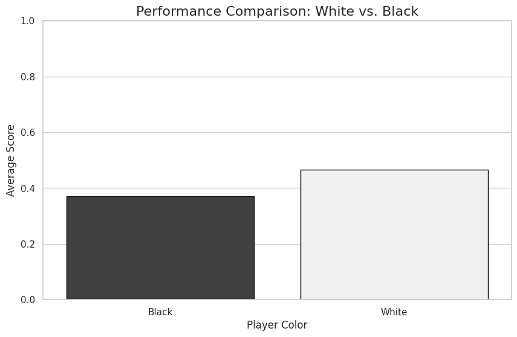
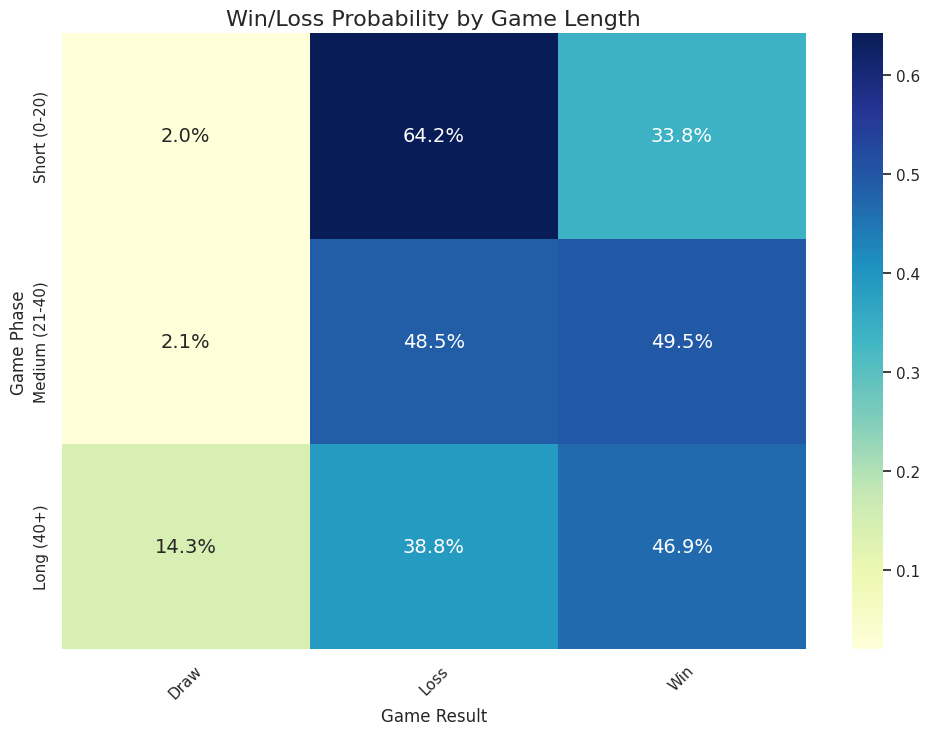
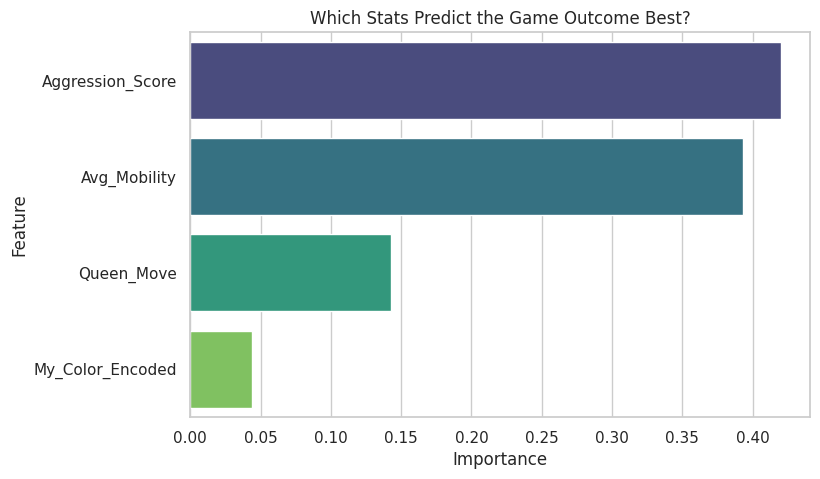
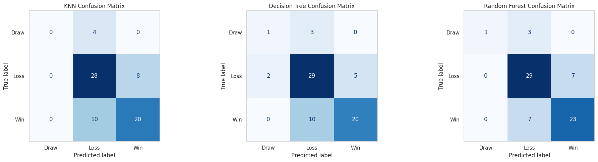

# Chess Move Pattern Analysis

## Project Overview
This project applies Data Science techniques to analyze personal online chess game history. By scraping, processing, and modeling game data, the project aims to uncover behavioral patterns, test common chess wisdom against actual performance, and predict game outcomes using Machine Learning.

**Course:** Introduction to Data Science
**Goal:** To demonstrate the end-to-end data pipeline—from raw PGN parsing to statistical hypothesis testing and predictive modeling.

---

## 1. Motivation
I play online chess regularly, but I have never analyzed my own habits systematically.
By collecting and analyzing my own game data, I aim to discover strengths, weaknesses, and playing tendencies. Specifically, I want to move beyond intuition and use **statistical evidence** to answer questions like:
* *Does bringing the Queen out early actually cause me to lose?*
* *Is my performance significantly better as White?*
* *Can machine learning predict if I will win based on my opening metrics?*

---

## 2. Data Pipeline

### Data Sources
* **Primary Source:** Personal game history (API export).
* **Format:** Portable Game Notation (PGN) and JSON.

### Data Collection & Cleaning
1.  **Extraction:** Downloaded full game history via API.
2.  **Parsing:** Used the `python-chess` library to parse move sequences.
3.  **Feature Engineering:**
    * Extracted **Queen Development Move** (move number where Queen first moved).
    * Calculated **Aggression Scores** and **Mobility Metrics**.
    * Classified **Game Phase** (Short: <20 moves, Medium: 21-40, Long: >40).
    * Encoded Results: Win (1), Draw (0.5), Loss (0).

---

## 3. Statistical Analysis & Hypothesis Testing

We formally tested three hypotheses regarding playing style to see if common chess theories apply to my specific gameplay.

### Hypothesis 1: The "Early Queen" Myth
* **Theory:** Early queen development is generally considered bad practice in chess.
* **Test:** Independent T-Test comparing scores of games with Early (≤ Move 10) vs. Late Queen moves.
* **Result:** $p = 0.26$ (Fail to Reject $H_0$)

**Discussion:**
The visual above shows that my average score is actually slightly *higher* when moving the Queen early (0.46) compared to late (0.38). The statistical test confirms that this difference is not significant.
* **Conclusion:** Contrary to standard advice, moving the Queen early is **not** a primary cause of my losses.

### Hypothesis 2: Performance by Color
* **Test:** Independent T-Test comparing average scores for White vs. Black.
* **Result:** $p = 0.066$ (Marginally Significant)

**Discussion:**
There is a visible performance gap. I score nearly **0.47** as White but drop to **0.37** as Black.
* **Conclusion:** While the p-value is just above the standard 0.05 threshold, the trend suggests a "Color Complex." I am comfortable attacking with the initiative (White) but struggle to defend or equalize as Black.

### Hypothesis 3: Game Length and Outcome
* **Theory:** The length of the game correlates with the result (e.g., blunders occur in short games).
* **Test:** Chi-Square Test of Independence.
* **Result:** $p < 0.001$ (Highly Significant)

**Discussion:**
This heatmap reveals the most critical insight of the project.
* **Short Games (Top Row):** Deep blue indicates a high density of losses (~65%) in games under 20 moves.
* **Long Games (Bottom Row):** The win rate improves drastically if the game extends beyond 40 moves.
* **Conclusion:** My biggest weakness is opening survival. I do not lose because of endgame technique; I lose because of opening blunders.

---

##  4. Machine Learning Modeling

We implemented three supervised learning models to predict the game outcome (`Win`, `Loss`, `Draw`) based on playing style features (*Aggression, Mobility, Queen Move, Color*).

### Model Accuracy Comparison

| Model | Accuracy | Key Observation |
| :--- | :--- | :--- |
| **K-Nearest Neighbors (KNN)** | 69% | Struggled with the "Draw" class due to class imbalance. |
| **Decision Tree** | 71% | Provided interpretable rules but slightly overfit. |
| **Random Forest** | **76%** | **Best Performance.** Successfully captured non-linear relationships. |

### Feature Importance (Random Forest)
To understand *how* the model predicts wins, we analyzed Feature Importance.

**Discussion:**
* **Aggression Score** is the dominant predictor. This aligns with the finding that I am a tactical player; active play correlates strongly with winning.
* **Queen Move** timing is the least important predictor, reinforcing the results from Hypothesis 1.

### Model Performance (Confusion Matrix)

**Discussion:**
The Confusion Matrix shows the model is highly accurate at distinguishing **Wins vs. Losses**. However, it struggles to predict **Draws** (Top Left), often misclassifying them as losses. This is likely due to the rarity of draws in the dataset (Class Imbalance).

---

## 5. Final Conclusions

1.  **Survival is Key:** My biggest weakness is opening blunders. If I survive the first 20 moves, my win rate flips from negative to positive.
2.  **Aggression Pays Off:** The ML analysis proves that higher Aggression Scores correlate with winning. Passive play is a losing strategy for me.
3.  **Queen Safety:** My early Queen moves are not the primary cause of my losses, debunking my initial assumption.

---

##  Tools & Technologies
* **Python Libraries:** `pandas`, `numpy`, `scipy` (Stats), `scikit-learn` (ML), `python-chess`.
* **Visualization:** `matplotlib`, `seaborn`.
* **Environment:** Google Colab / Jupyter Notebook.

---

## 6. Future Work

To improve this project in the future, I plan to:

1.  **Analyze Specific Openings:**
    * Group my games by opening (e.g., Sicilian, Queen's Gambit) to see exactly which ones lead to my early losses.

2.  **Use a Chess Engine:**
    * Instead of just looking at Win/Loss, I will use a chess engine (like Stockfish) to measure the *quality* of my moves and identify blunders.

3.  **Improve Prediction Models:**
    * My current models struggle to predict "Draws" because they are rare. I will try advanced techniques to fix this imbalance and improve accuracy.

4.  **Factor in Opponent Skill:**
    * I will adjust my performance metrics to account for the opponent's rating (ELO). Winning against a strong player should count more than winning against a weak one.
